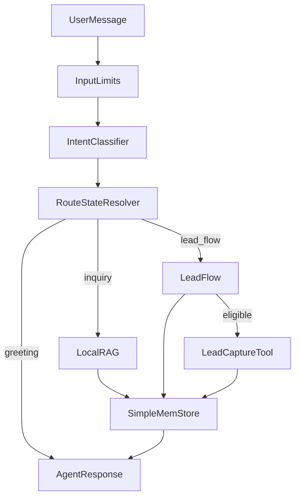

# Runtime Architecture

## End-to-end sequence

## Lead flow notes

- Slot order: `name -> email -> platform`
- One missing field is requested per turn.
- Email/platform retries are counted; fallback allows user to skip capture for now.
- Tool call is gated on complete validated payload.
- Capture uses payload fingerprint for idempotency and a timeout/circuit-breaker wrapper.
